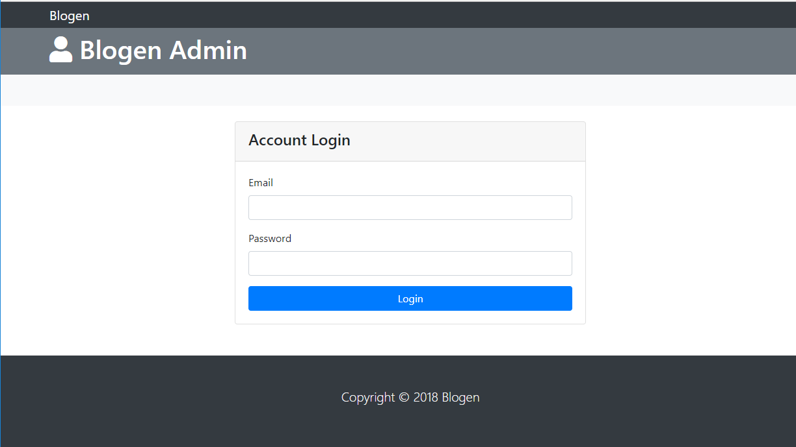
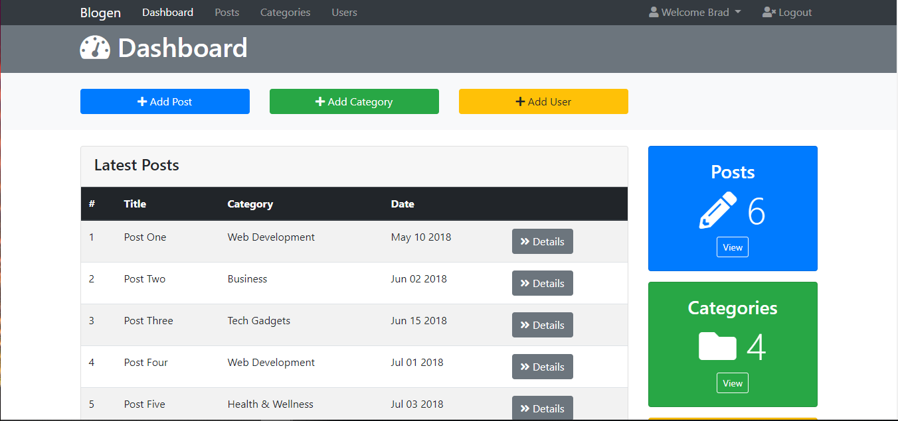
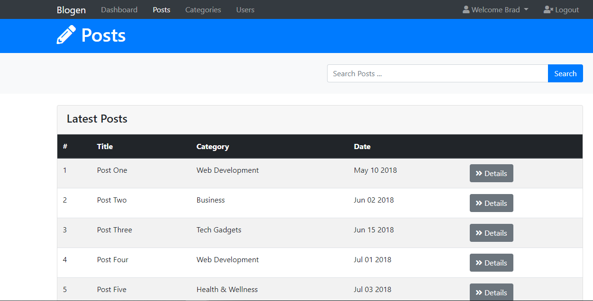
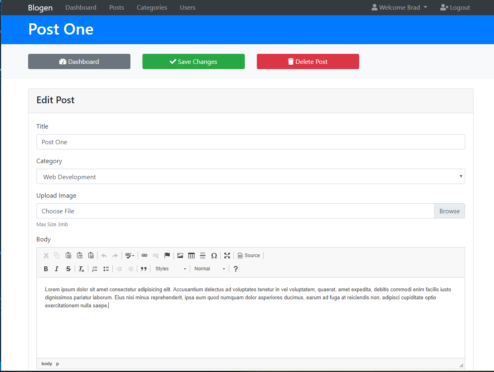
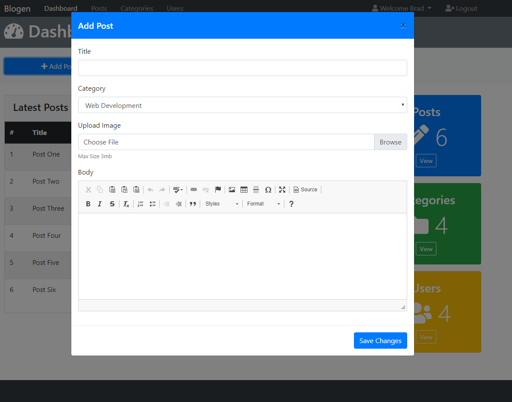
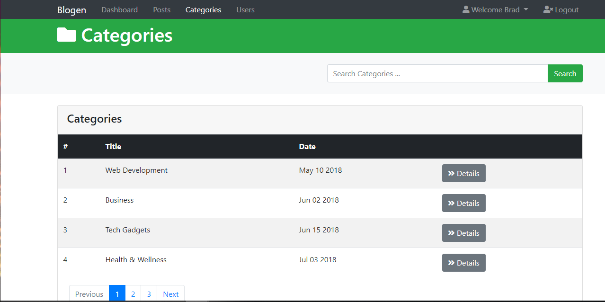
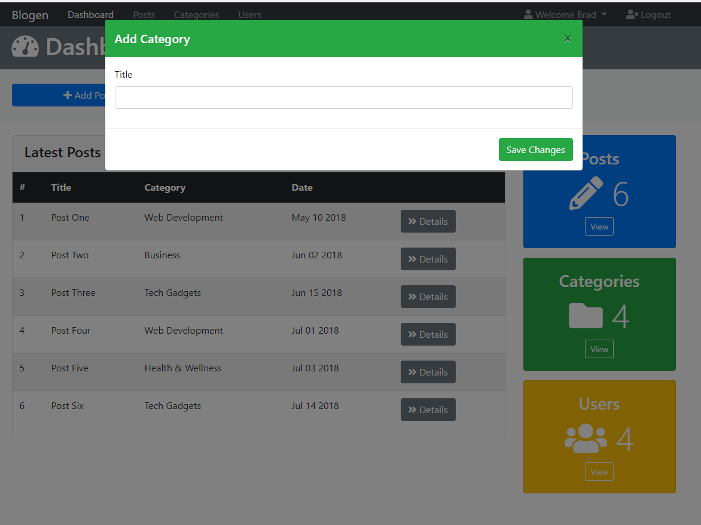
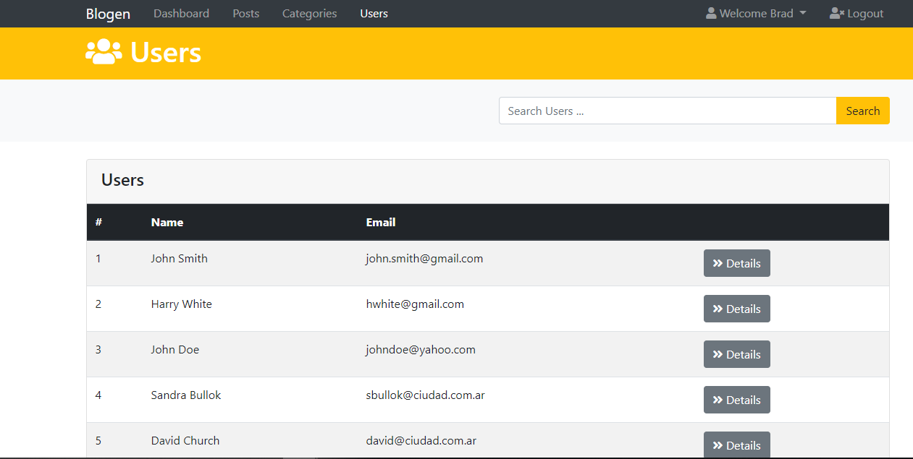
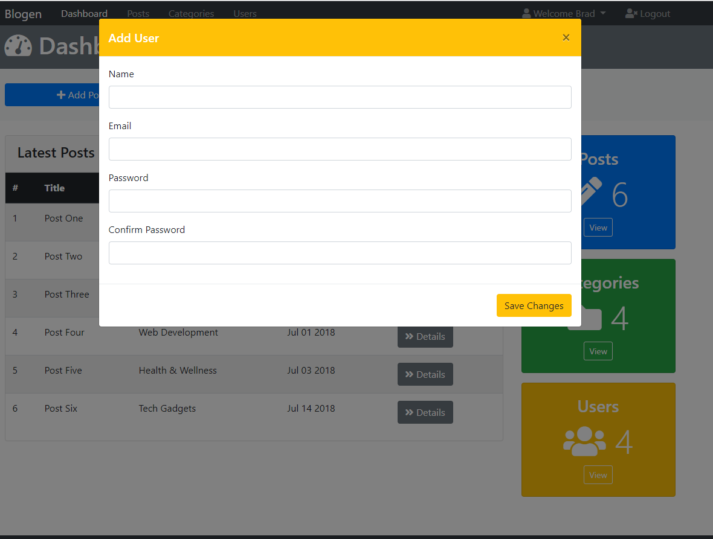
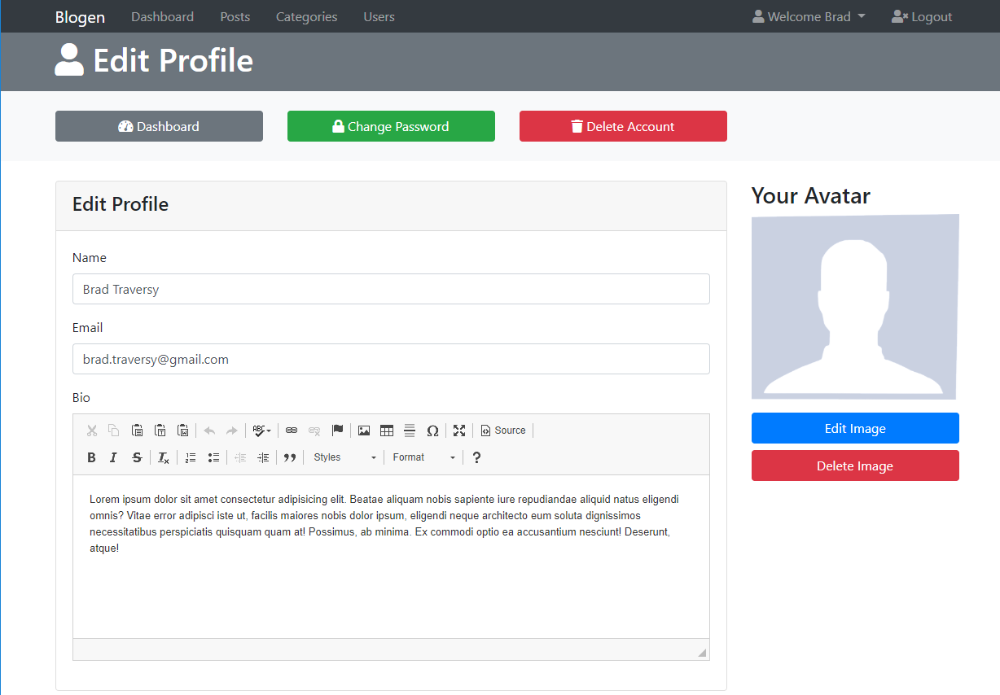

# Section 10: Blogen Admin UI

[VOLVER a README.md](README.md)

## Introducción

- [Section 10: Project Blogen Admin UI](https://www.udemy.com/bootstrap-4-from-scratch-with-5-projects/learn/v4/t/lecture/7685664?start=0)

## Navbar and Main Header

- [Section 10: Navbar and Main Header](https://www.udemy.com/bootstrap-4-from-scratch-with-5-projects/learn/v4/t/lecture/7685670?start=0)

## Add buttons and Modals

- [Section 10: Add buttons and Modals](https://www.udemy.com/bootstrap-4-from-scratch-with-5-projects/learn/v4/t/lecture/7685674?start=0)

## Finishing the Dashboard

- [Section 10: Finishing the Dashboard](https://www.udemy.com/bootstrap-4-from-scratch-with-5-projects/learn/v4/t/lecture/7685676?start=0)

## Resource Table Pages

- [Section 10: Resource Table Pages](https://www.udemy.com/bootstrap-4-from-scratch-with-5-projects/learn/v4/t/lecture/7685680?start=0)

## Details and Setting Pages

- [Section 10: Details and Setting Pages](https://www.udemy.com/bootstrap-4-from-scratch-with-5-projects/learn/v4/t/lecture/7685682?start=0)

## Profile and Login Pages

- [Section 10: Details and Setting Pages](https://www.udemy.com/bootstrap-4-from-scratch-with-5-projects/learn/v4/t/lecture/7685692?start=0)

## Muestra

### Login Page

### Dashboard Page

### Posts Page

### Posts Details Page

### Add Post Page

### Categories Page

### Add Category Page

### Users Page

### Add User Page

### Profile Page

## Referencias

[CKEditor](https://cdn.ckeditor.com/)
