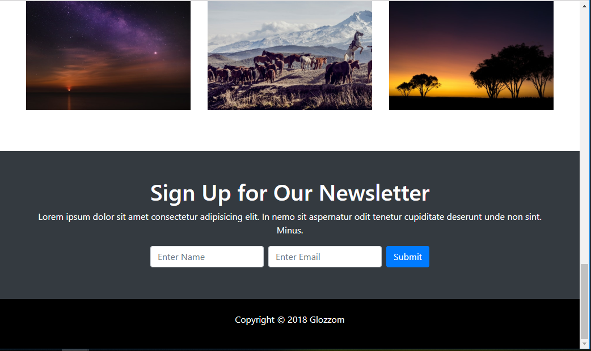

# Section 9: Project Glozzom - Showcase Theme

[VOLVER a README.md](README.md)

## Introducción

- [Section 9: Project Glozzom with carousel](https://www.udemy.com/bootstrap-4-from-scratch-with-5-projects/learn/v4/t/lecture/7685766?start=0)

## Showcase with Carousel

[Section 9: Showcase with Carousel](https://www.udemy.com/bootstrap-4-from-scratch-with-5-projects/learn/v4/t/lecture/7685766?start=0)

## Home Icons, Heading & Info Sections

[Section 9: Home Icons, Heading & Info Sections](https://www.udemy.com/bootstrap-4-from-scratch-with-5-projects/learn/v4/t/lecture/7685776?start=0)

## Video Section with Autoplay Modal

[Section 9: Video Section with Autoplay Modal](https://www.udemy.com/bootstrap-4-from-scratch-with-5-projects/learn/v4/t/lecture/7685796?start=0)

## Photo Gallery and Newsletter

[Section 9: Photo Gallery and Newsletter](https://www.udemy.com/bootstrap-4-from-scratch-with-5-projects/learn/v4/t/lecture/7685806?start=0)

## About Page - Header and About Section

[Section 9: Page Header and About Section](https://www.udemy.com/bootstrap-4-from-scratch-with-5-projects/learn/v4/t/lecture/7685814?start=0)

## About Page - Icon Boxes and Testimonial slider

[Section 9: Icon Boxes and Testimonial slider](https://www.udemy.com/bootstrap-4-from-scratch-with-5-projects/learn/v4/t/lecture/7685820?start=0)

## Services Page

[Section 9: Services Page](https://www.udemy.com/bootstrap-4-from-scratch-with-5-projects/learn/v4/t/lecture/7685828?start=0)

## Blog Page

[Section 9: Blog Page](https://www.udemy.com/bootstrap-4-from-scratch-with-5-projects/learn/v4/t/lecture/7685840?start=0)

## Contact Page

[Section 9: Contact Page](https://www.udemy.com/bootstrap-4-from-scratch-with-5-projects/learn/v4/t/lecture/7816612?start=0)

## Muestra

### Imagenes de la página Home

### Imageness de la página About

### Imagenes de la página Services

### Imagenes de la página Blog

### Imagenes de la página Contact

## referencias

[ekko Lightbox for Bootstrap](http://ashleydw.github.io/lightbox/)  
[slick slider](http://kenwheeler.github.io/slick/)  
[slick slider cdn](https://cdnjs.com/libraries/slick-carousel)
