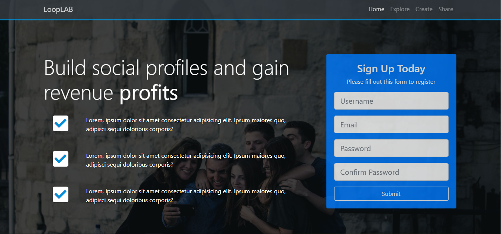
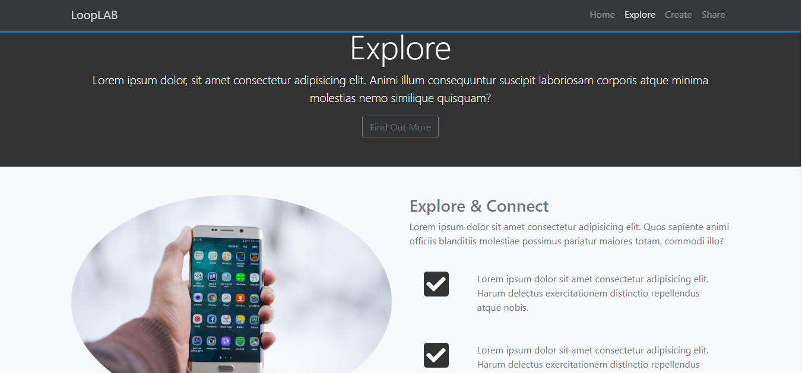
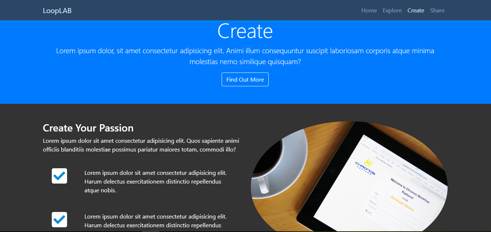
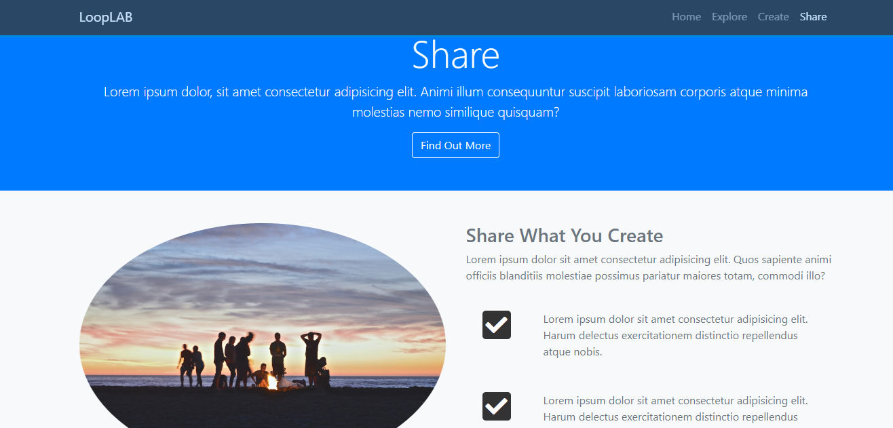
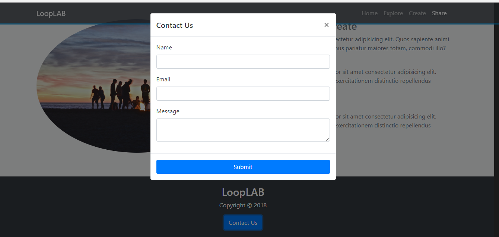

# Section 7: Project LoopLab - Social Theme

[VOLVER a README.md](README.md)

## Indice

- [Section 7: Project LoopLab - Social Theme](https://www.udemy.com/bootstrap-4-from-scratch-with-5-projects/learn/v4/t/lecture/7685610?start=0)
- [Setup and NavBar](https://www.udemy.com/bootstrap-4-from-scratch-with-5-projects/learn/v4/t/lecture/7685624?start=0)
- [Home Section](https://www.udemy.com/bootstrap-4-from-scratch-with-5-projects/learn/v4/t/lecture/7685628?start=0)
- [Explore Section](https://www.udemy.com/bootstrap-4-from-scratch-with-5-projects/learn/v4/t/lecture/7685632?start=0)
- [Create and Share Section](https://www.udemy.com/bootstrap-4-from-scratch-with-5-projects/learn/v4/t/lecture/7685636?start=0)
- [Footer, Contact Modal, Menu Smooth scroll](https://www.udemy.com/bootstrap-4-from-scratch-with-5-projects/learn/v4/t/lecture/7685640?start=0)

## Muestra

