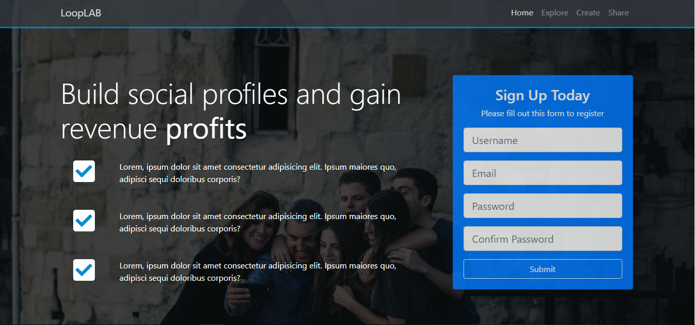

# Section 8: Project Mizuxe - Book Theme

[VOLVER a README.md](README.md)

## Indice

- [Section 8: Project Mizuxe - Book Theme](https://www.udemy.com/bootstrap-4-from-scratch-with-5-projects/learn/v4/t/lecture/7685646?start=0)

## Customizar Bootstrat:

Para poder customizar **Bootstrat** es necesario compliar el `CSS` utilizando un `SASS compiler` (Koala).

Se deben seguir los siguientes pasos:

## Muestra

## referencias

[Koala - SASS compiler](http://koala-app.com/)
