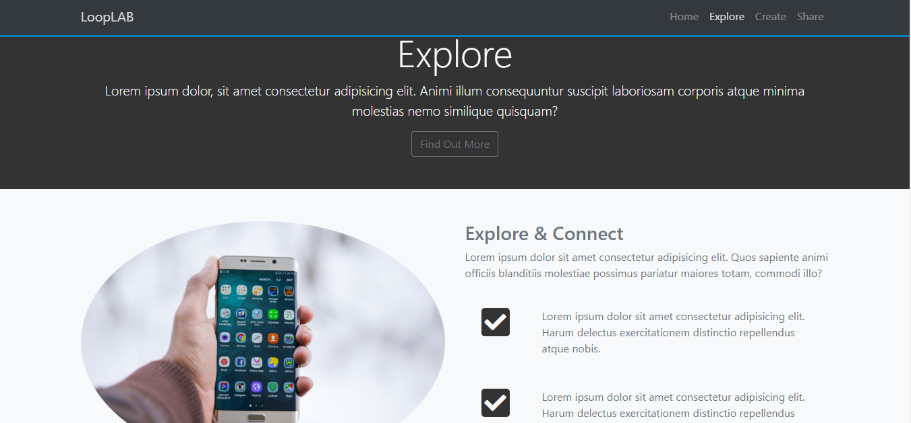

# Section 8: Project Mizuxe - Book Theme

[VOLVER a README.md](README.md)

## Indice

- [Section 8: Project Mizuxe - Book Theme](https://www.udemy.com/bootstrap-4-from-scratch-with-5-projects/learn/v4/t/lecture/7685646?start=0)

## Customizar Bootstrap

Para poder customizar **Bootstrat** es necesario compliar el `CSS` utilizando un `SASS compiler` (Koala).

Se deben seguir los pasos indicados en el siguinete video:

[Video: Setting Up Sass with Koala](https://www.udemy.com/bootstrap-4-from-scratch-with-5-projects/learn/v4/t/lecture/10645918?start=0)

## Custon Navbar and Logo

[Video: Custom Navbar & Logo](https://www.udemy.com/bootstrap-4-from-scratch-with-5-projects/learn/v4/t/lecture/7685650?start=0)

## Showcase and Primary Color Change

[Video: Showcase and Primary Color Change](https://www.udemy.com/bootstrap-4-from-scratch-with-5-projects/learn/v4/t/lecture/7685654?start=0)

## Muestra

## referencias

[Koala - SASS compiler](http://koala-app.com/)
