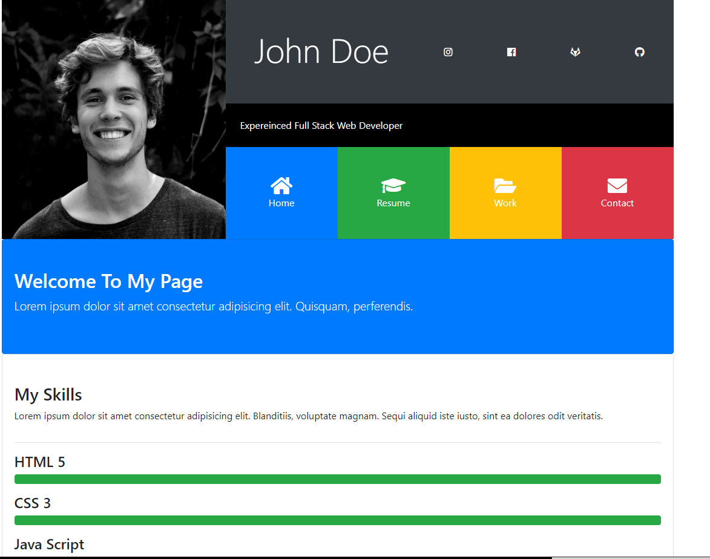
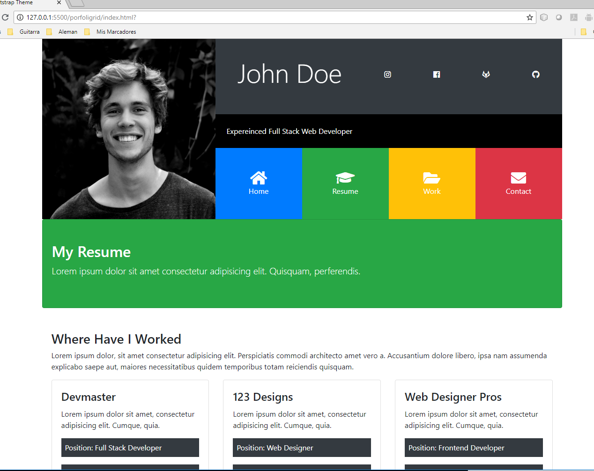
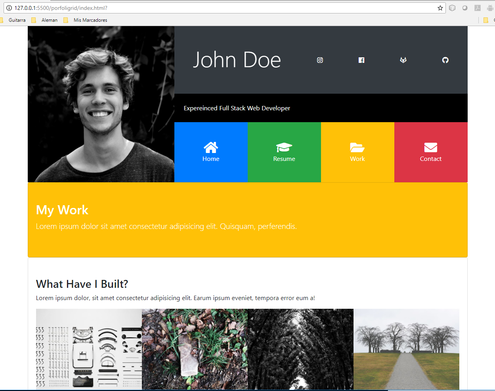
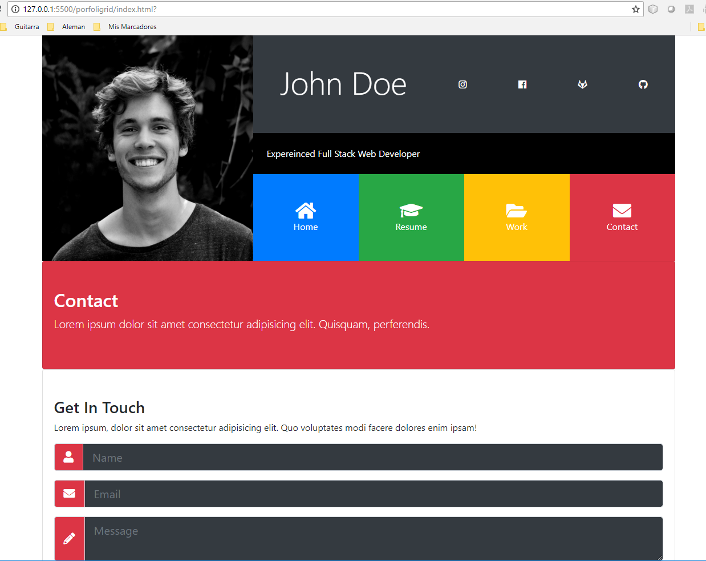

# Section 11: Portfoligrid

[VOLVER a README.md](README.md)

## Introducción

- [Section 11: Project Porfoligrid](https://www.udemy.com/bootstrap-4-from-scratch-with-5-projects/learn/v4/t/lecture/7685850?start=0)

## Main Header

- [Section 11: Main Header](https://www.udemy.com/bootstrap-4-from-scratch-with-5-projects/learn/v4/t/lecture/7685854?start=0)

## Home Collapse and Footer

- [Section 11: Home Collapse Content and Footer](https://www.udemy.com/bootstrap-4-from-scratch-with-5-projects/learn/v4/t/lecture/7685860?start=0)

## Resume Collapse

- [Section 11: Resume Collapse Content and Footer](https://www.udemy.com/bootstrap-4-from-scratch-with-5-projects/learn/v4/t/lecture/7685866?start=0)

## Work Collapse

- [Section 11: Work Collapse Content](https://www.udemy.com/bootstrap-4-from-scratch-with-5-projects/learn/v4/t/lecture/7685870?start=0)

## Contact Collapse

- [Section 11: Contact Collapse Content](https://www.udemy.com/bootstrap-4-from-scratch-with-5-projects/learn/v4/t/lecture/7816356?start=0)

## Muestra

### Home page

### Resume Page

### Work Page

### Contact Page

